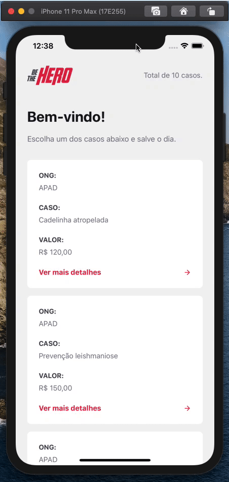
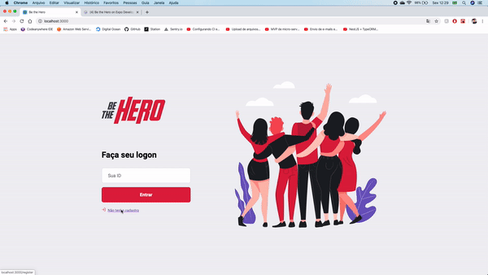
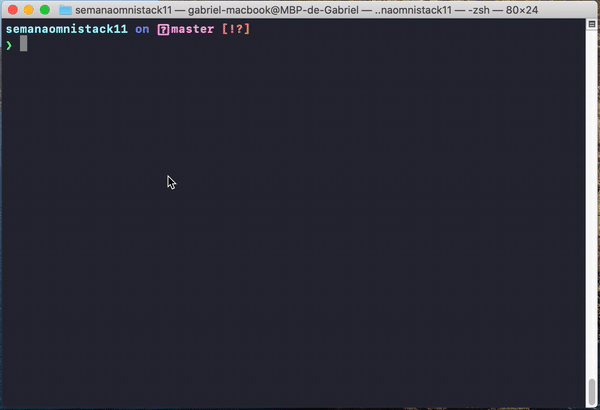
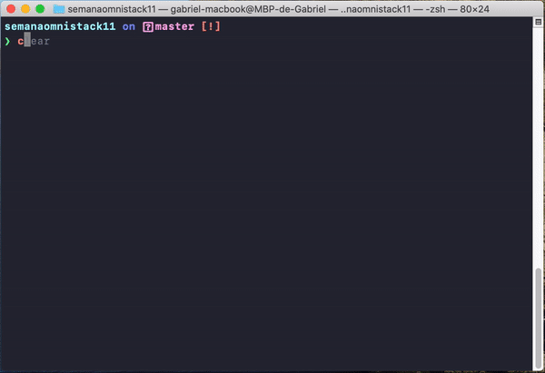
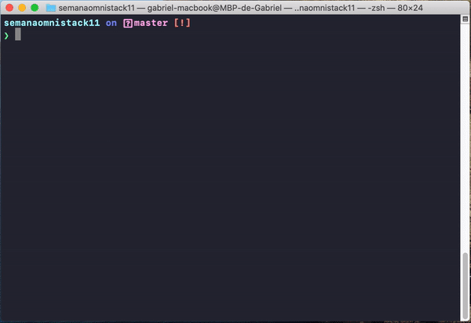
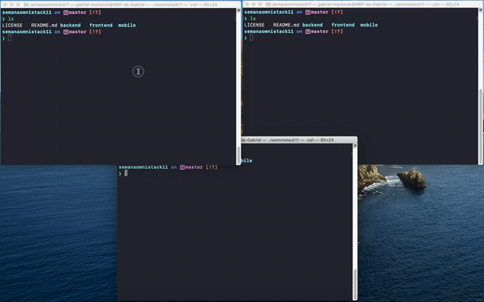

<h1 align="center">
    
</h1>

<h4 align="center">
  :rocket: Semana OmniStack 11.0
</h4>

  
  
  

---

## :art: Interface

<h1>
    
    
</h1>

---

## :hammer: Configurar a aplicação:

- Certifique-se de estar na pasta raiz da aplicação antes de executar **cada um** dos passos a seguir.

- Digite no terminal `cd backend` e então `yarn` e aguarde a instalação das dependências necessárias. Após isso, digite `npx knex migrate:latest` para rodar as migrations do banco de dados.

<h1 align="center">
    
</h1>

- Digite no terminal `cd frontend` e então `yarn` e aguarde a instalação das dependências necessárias.

<h1 align="center">
    
</h1>

- Digite no terminal `cd mobile` e então `yarn` e aguarde a instalação das dependências necessárias.

<h1 align="center">
    
</h1>

---

## :horse_racing: Iniciar a aplicação:

- Para iniciar a API, basta entrar na pasta usando `cd backend` e então `yarn start` para levantar o servidor.

- Para iniciar o frontend web, bastar entrar na pasta usando `cd frontend` e então `yarn start`para levantar o servidor.

- Para inciar o mobile, basta entrar na pasta usando `cd mobile` e então `yarn start` para levantar o servidor. Neste caso, você pode usar tanto um simulador no computador ou [baixar](https://apps.apple.com/br/app/expo-client/id982107779) o aplicativo expo para rodar a aplicação mobile diretamente no seu celular, para isso basta escanear o QR CODE com a câmera do celular.

<h1 align="center">
    
</h1>

---

## :package: Importar configurações do Insomnia:

Para testar a API do BeTheHero, baixe e instale o [Insomnia](https://insomnia.rest/download/) e clique no botão abaixo.

---

## :memo: Licença

[MIT](./LICENSE) &copy; [Rocketseat](https://rocketseat.com.br/)
